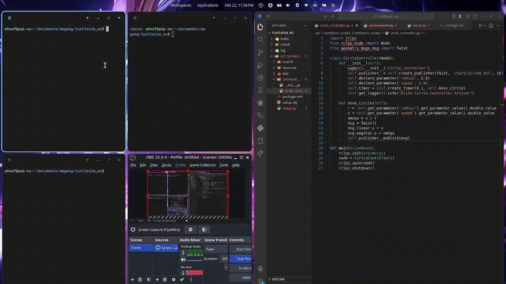
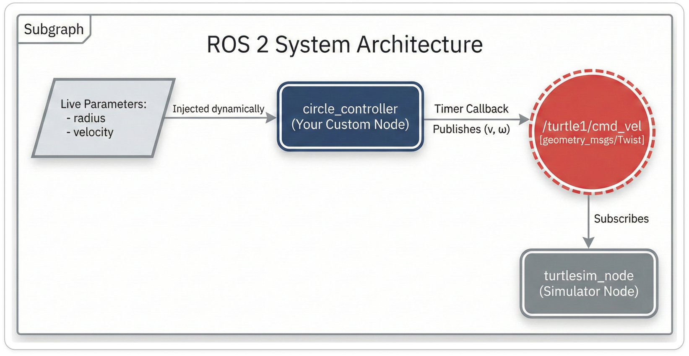

 Circle Turtles With ROS2 

---


| Name  | Division        | Sub-Division  |
| ----- | ---------- | ---------- |
| Ahnaf Al Ghiffarri Ahtasyafi   | PGR | Vision |

---

Repositori ini berisi implementasi *node* ROS 2 (Jazzy) untuk mengendalikan pergerakan Turtlesim dalam lintasan melingkar yang sempurna

## Demo Simulasi


## Arsitektur & Mekanisme Kerja



Berdasarkan Technical Documentation Report (TDR) ROS 2 Jazzy Jalisco, arsitektur kendali ini dirancang menggunakan konsep *publisher* asinkron berbasis `rclpy.Node` untuk mengotomatisasi injeksi perintah gerakan secara otonom. Secara teknis, kode ini bekerja dengan menginisialisasi fungsi *timer callback* `move_circle()` yang dieksekusi secara periodik setiap 0.1 detik guna mempublikasikan pesan bertipe `geometry_msgs/msg/Twist` ke dalam topik `/turtle1/cmd_vel`. Sistem ini dapat berjalan secara kontinu dan stabil karena dieksekusi di dalam *loop* `rclpy.spin()` yang menjaga *lifecycle* node tetap aktif, di mana pada setiap siklus putarannya, rutin program akan mengekstraksi nilai parameter terkini (radius dan kecepatan) untuk mengkalkulasi kecepatan sudut dan inject ke sumbu-Z, sehingga memberi perintah kura-kura untuk membentuk lingkaran yang smooth.

## Apa yang berbeda kali ini?
* **Dynamic Parameter Injection:** Saya mencoba membuat radius dan kecepatan kura-kura agar dapat diubah kapan saja secara *live* tanpa perlu mematikan atau restart node.


## Cara Menjalankan
Ikuti langkah di bawah ini menggunakan 3 terminal terpisah:

```bash
# ==========================================
# TERMINAL 1: Siapkan environment simulasi
# ==========================================
ros2 run turtlesim turtlesim_node

# ==========================================
# TERMINAL 2: Jalankan Circle Controller
# ==========================================
cd ~/Folder/turtlesim_ws
source install/setup.bash
ros2 run turtlesim_nodes circle_controller

# ==========================================
# TERMINAL 3: Ubah ukuran radius
# ==========================================
source install/setup.bash
ros2 param set /circle_controller radius 1.0